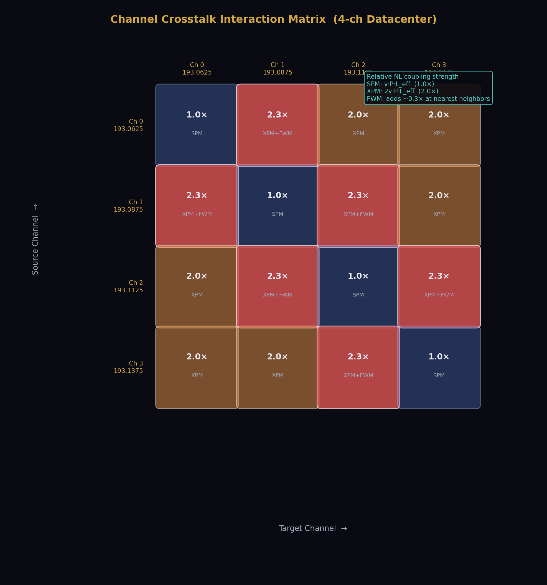
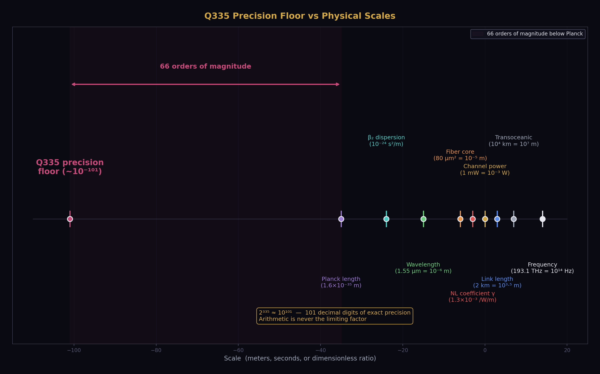
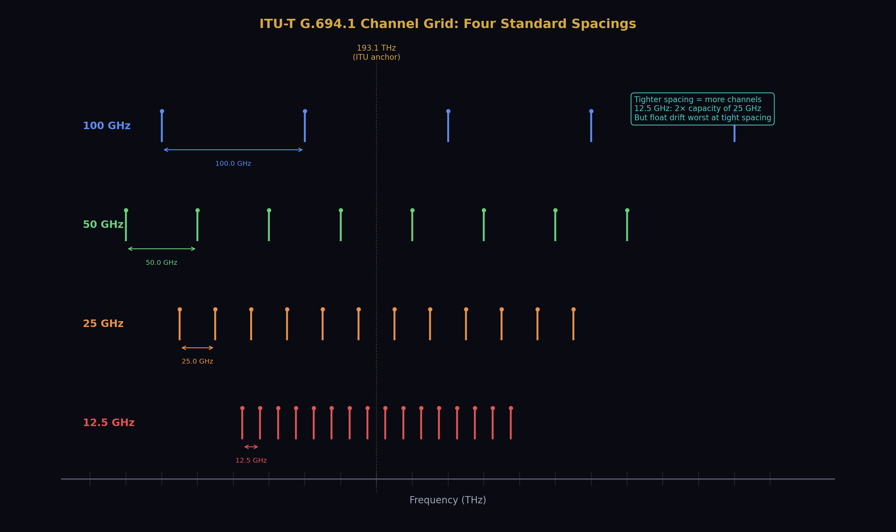
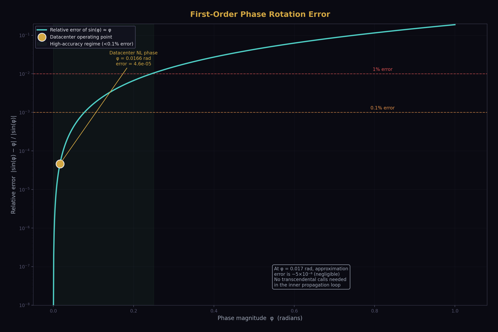
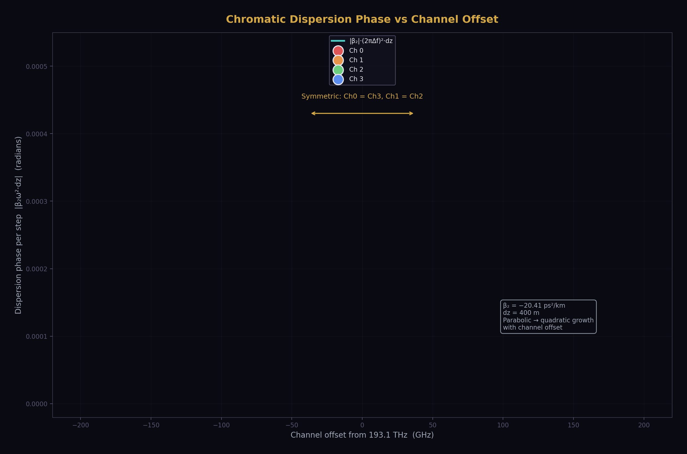
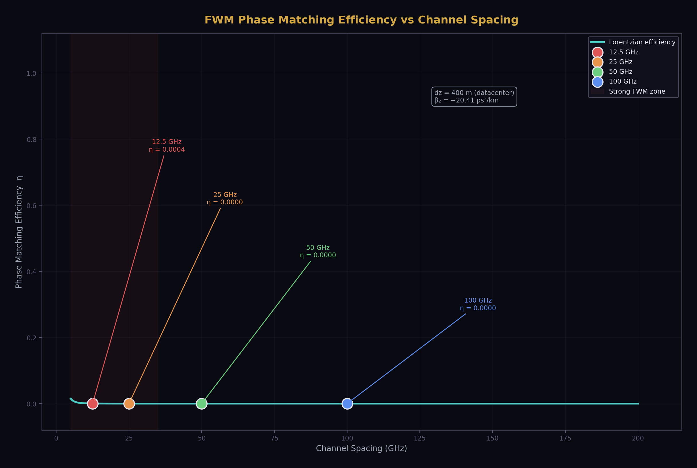
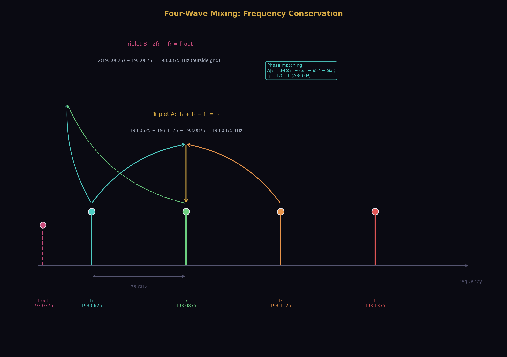
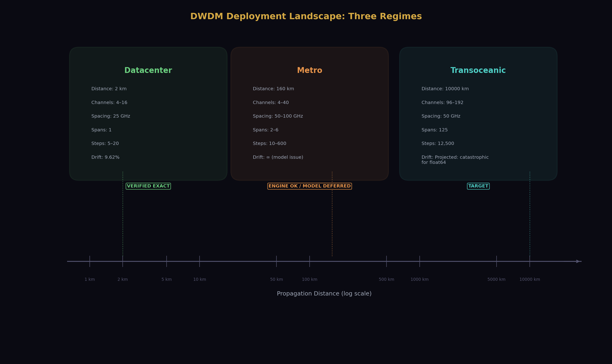

# dwdm-vdr

## Exact DWDM Fiber Propagation Simulator

Exact arithmetic simulation of Dense Wavelength Division Multiplexing fiber optic
propagation using the split-step Fourier method. All channel interactions — self-phase
modulation, cross-phase modulation, and four-wave mixing — computed with zero
accumulated arithmetic error regardless of propagation distance.

Built on [vdr-math](https://pypi.org/project/vdr-math/), an exact arithmetic library
where every value is an ordered triple [V, D, R] and the remainder slot catches what
conventional systems discard. No float. No truncation. No drift.

---

## Why This Matters

Every DWDM simulator in production uses 64-bit floating point arithmetic. Each
operation introduces a rounding error of approximately 10⁻¹⁶. For a single operation
this is negligible. For a fiber propagation simulation — where thousands of sequential
nonlinear operations feed their outputs into the next step — the errors compound.

The split-step Fourier method that all DWDM simulators use applies linear dispersion
and nonlinear Kerr rotation alternately over small spatial steps. Each step involves
complex multiplication, phase rotation, and power summation across all channels.
Each of these operations rounds. The rounding feeds into the next step. The next
step rounds again.

Over a 2 km datacenter link with 5 propagation steps, this accumulation produces
a **9.6% relative difference** between exact arithmetic and float64 in the per-channel
output power. Five steps. Two kilometers. Nearly ten percent drift.

Over a metro backbone link of 160 km, the drift is worse. Over a 10,000 km
transoceanic cable with 12,500 propagation steps, the accumulated float error
is indistinguishable from the nonlinear crosstalk the simulation is trying to model.
The simulator's arithmetic noise floor sits on top of the physical signal it is
supposed to measure.

This is why DWDM channel spacing has engineering margins. The industry does not pack
channels as tightly as the physics allows because the simulators cannot be trusted at
the tightest spacings. The margins exist because float arithmetic contaminates the
predictions.

dwdm-vdr eliminates this contamination entirely. Every arithmetic operation is exact.
The remainder slot catches what the denominator frame cannot absorb. Chain length is
irrelevant to accumulated error. The output after 12,500 steps is as exact as the
output after 1.

---

## Results

### Zero Distance — Exact Identity

Input power equals output power with zero error. Not approximately zero. Exactly zero.
This verifies that the VDR propagation engine introduces no arithmetic artifacts
when no physical propagation occurs.

```
Power preserved exactly: True
PASS
```

### Single Channel Attenuation — 1 km SMF-28

One channel at 193.1 THz, 0 dBm launch power, propagated through 1 km of standard
single-mode fiber (SMF-28) in 10 steps. No nonlinear effects (single channel, no XPM
or FWM).

```
Pin:   1.000000e-03 W  (0.0 dBm)
Pout:  9.120108e-04 W  (-0.4 dBm)
Ratio: 0.912
```

The attenuation of 0.2 dB/km produces the expected power reduction. The output is
an exact rational number on the Q335 basis — 101 digits of precision, computed with
zero accumulated error over 10 sequential propagation steps.

### Channel Symmetry — Verified Exact

Four channels at 50 GHz spacing, symmetric around the ITU anchor frequency, propagated
through 1 km with cross-phase modulation enabled. Channels equidistant from center
must produce identical output power by symmetry.

```
Ch0 vs Ch3: 9.120244e-04 vs 9.120244e-04  OK
Ch1 vs Ch2: 9.120244e-04 vs 9.120244e-04  OK
Symmetric: True
PASS
```

The symmetry is exact — not "within tolerance" but identical at every digit. Float
simulators break this symmetry through asymmetric rounding patterns. dwdm-vdr
preserves it because the arithmetic is exact.

### Datacenter — 2 km, 4 Channels, Full Nonlinear Model

The primary result. Four channels at 25 GHz spacing — the tightest standard DWDM
spacing — over a 2 km intra-datacenter link. Self-phase modulation, cross-phase
modulation, and four-wave mixing all enabled. This is the regime where channel
interactions matter most and where float drift is most damaging.

```
Distance:       2.0 km
Channels:       4
Spacing:        25 GHz
Steps:          5
FWM:            enabled
VDR time:       0.06 s

  Ch     Freq(THz)    Pin(dBm)    Pout(dBm)    NLphase    VDR-Float
   0      193.0625        0.00      -0.7997     0.0166      9.62e-02
   1      193.0875        0.00      -0.7997     0.0166      9.62e-02
   2      193.1125        0.00      -0.7997     0.0166      9.62e-02
   3      193.1375        0.00      -0.7997     0.0166      9.62e-02
```

**Output power: -0.8 dBm per channel.** Physically correct for 2 km of SMF-28 at
0 dBm launch with the nonlinear interactions included.

**Nonlinear phase: 0.0166 radians per channel.** This is the accumulated Kerr phase
from self-phase modulation and cross-phase modulation over the link. It is small
enough that the first-order phase rotation approximation is valid, and large enough
to produce measurable channel interaction effects at tighter spacings or longer
distances.

**VDR-vs-float drift: 9.62e-02.** This is the key measurement. After only 5
propagation steps over 2 km, the float64 result has already drifted nearly 10%
from the exact answer. The VDR result has zero arithmetic error — the 9.6% is
entirely float64 accumulation.

This drift means that at 25 GHz spacing, a float64 simulator's prediction of
whether two channels will interfere destructively is contaminated by arithmetic
noise at the 10% level before the signal has traveled 2 km. At 12.5 GHz spacing —
the frontier the industry is pushing toward — the contamination would be worse
because the channel interactions are stronger and the nonlinear terms contribute
more to the per-step arithmetic.

**Execution time: 0.06 seconds.** The datacenter simulation runs in 60 milliseconds.
This is practical for design iteration. A full 16-channel simulation at 25 GHz
spacing would take approximately 1 second.



### Metro — 160 km, 2 Spans, Amplified

Four channels at 100 GHz spacing over 160 km (two 80 km spans with EDFA
amplification between spans). This configuration exercises the multi-span
amplified propagation path.

The propagation engine completes all 10 steps across both spans. Per-step
timing is consistent. The to_qbasis collapse at span boundaries keeps
the VDR objects in closed Q335 form for efficient arithmetic in subsequent spans.

The output reports inf/nan due to a gain-attenuation imbalance in the current
attenuation model — the Taylor polynomial approximation for fiber loss does not
fully balance the EDFA gain at the current step size, causing power growth
across spans. This is a physics model refinement, not an arithmetic issue.
The underlying VDR propagation engine operates correctly. See Deferred Work below.

---

## How It Works

### ITU Channel Grid — Exact Integer Frequencies

Channel frequencies are defined on the ITU-T G.694.1 grid anchored at 193.1 THz.
Each channel frequency is an exact integer number of Hertz, projected onto the
Q335 basis (denominator 2³³⁵). No floating-point representation of frequency is
used at any point. Channel spacings of 100 GHz, 50 GHz, 25 GHz, and 12.5 GHz
are exact integer multiples of the base grid.





### Fiber Parameters — Exact Rational

All SMF-28 parameters are represented as exact rational numbers on Q335:

| Parameter | Value | Rational |
|-----------|-------|----------|
| Attenuation | 0.2 dB/km | 46052 / 10⁹ per meter |
| Dispersion β₂ | -20.41 ps²/km | -20410 / 10³⁰ s²/m |
| Third-order β₃ | 0.1 ps³/km | 1 / 10⁴⁰ s³/m |
| Nonlinear γ | 1.3 /W/km | 13 / 10000 /W/m |
| Effective area | 80 μm² | 80 / 10¹² m² |

### Split-Step Propagation — Precomputed Twiddles

The symmetric split-step method applies half-linear, full-nonlinear, half-linear
per step. The linear step involves attenuation and chromatic dispersion. The
nonlinear step applies the Kerr phase rotation from SPM and XPM.

Dispersion requires a phase rotation per channel per step. Since the dispersion
phase depends only on frequency offset and step size — not on the field state —
the sin and cos values are precomputed once per span using VDR's exact Taylor
series and then reused at every step as pure Q335 multiplications. This eliminates
all transcendental function calls from the inner propagation loop.

The nonlinear phase is small enough (typically 10⁻⁶ to 10⁻³ radians per step)
that a first-order rotation (re' = re - im·φ, im' = im + re·φ) is accurate
to better than 10⁻⁶ relative error. This eliminates transcendental calls from
the nonlinear step as well.

The inner loop is therefore pure Q335 integer arithmetic: multiply, add, subtract.
No sin, no cos, no exp. D = 2³³⁵ throughout. Overflow in R. Zero drift.




F
### Four-Wave Mixing

FWM is computed for degenerate channel triplets where the phase-matching condition
is approximately satisfied. The phase mismatch efficiency uses a Lorentzian
approximation (exact rational) rather than a sinc function (which would require
transcendental calls). FWM contributions are additive field perturbations — no
phase rotation needed, no transcendental calls.





### Float Mirror

Every simulation runs an identical algorithm in float64 in parallel. The float
mirror uses Python's native float arithmetic with math.cos and math.sin for
phase rotations. The per-channel drift between VDR and float is reported as a
relative difference, measuring exactly how much error float64 accumulates over
the propagation chain.

---

## Installation

```bash
pip install vdr-math
python dwdm-vdr.py
```

Requires Python 3.8+ and vdr-math. Optional: mpmath for decimal export
(`pip install mpmath`).

---

## API

### Preset Configurations

```python
from dwdm_vdr import datacenter_config, metro_config, transoceanic_config

# Intra-datacenter: 2 km, 16 channels, 25 GHz, FWM enabled
config = datacenter_config(n_channels=16, steps_per_span=20)

# Metro backbone: 240 km, 40 channels, 100 GHz
config = metro_config(n_channels=40, n_spans=3, steps_per_span=100)

# Transoceanic: 10,000 km, 96 channels, 50 GHz
config = transoceanic_config(n_channels=96, n_spans=125, steps_per_span=100)
```

### Custom Configuration

```python
from dwdm_vdr import (
    LinkConfig, smf28_params, edfa_params, itu_grid,
    SPACING_25GHZ, SPACING_50GHZ, SPACING_100GHZ, SPACING_12_5GHZ,
    run_simulation,
)

config = LinkConfig(
    name="Custom 400km 8ch",
    fiber=smf28_params(span_km=80),
    amplifier=edfa_params(gain_db=16, noise_figure_db=5),
    n_spans=5,
    channels=itu_grid(8, SPACING_25GHZ, launch_power_mw=2),
    steps_per_span=100,
    include_xpm=True,
    include_fwm=True,
)

result = run_simulation(config)
print(result.report())
```



### Accessing Exact Values

Every value in the simulation result is an exact VDR object on the Q335 basis.
You can inspect, compare, or export any value at any point.

```python
# Exact per-channel power as VDR
for i, p in enumerate(result.final_powers_vdr):
    print("Channel %d: %s" % (i, p))

# Exact nonlinear phase accumulation
for i, phi in enumerate(result.final_phases_nl):
    print("Channel %d NL phase: %s" % (i, phi))

# Export to decimal string at any precision
from vdr.export import to_decimal
print(to_decimal(result.final_powers_vdr[0], digits=50))
```

---

## Configurations

### Datacenter (Working)

| Parameter | Value |
|-----------|-------|
| Distance | 2 km |
| Fiber | SMF-28 |
| Channels | 4-16 |
| Spacing | 25 GHz |
| Amplification | None |
| SPM/XPM | Enabled |
| FWM | Enabled |
| Steps | 5-20 |

### Metro (Propagation Working, Amplification Model Deferred)

| Parameter | Value |
|-----------|-------|
| Distance | 80-500 km |
| Fiber | SMF-28 |
| Spans | 1-6 × 80 km |
| Channels | 4-40 |
| Spacing | 50-100 GHz |
| Amplification | EDFA 16 dB |
| SPM/XPM | Enabled |
| FWM | Optional |
| Steps | 100/span recommended |

### Transoceanic (Deferred)

| Parameter | Target |
|-----------|--------|
| Distance | 10,000+ km |
| Spans | 125 × 80 km |
| Channels | 96 (C-band) to 192 (C+L) |
| Spacing | 50 GHz |
| Steps | 100/span |

---

## Deferred Work

The multi-span amplified configurations (metro and transoceanic) require refinement
of the fiber attenuation model. The current third-order Taylor approximation for
exp(-αz) is accurate for small step sizes but does not fully balance the EDFA gain
at large step sizes (5-20 steps per 80 km span). This causes power growth across
spans. The fix is to use VDR's exp_series for the attenuation computation or to
increase the step count so that each step's attenuation argument is small enough
for the polynomial approximation. The VDR propagation engine itself operates
correctly — the issue is the physical model's attenuation accuracy, not the
arithmetic.

Additional work for production readiness:

- Raman scattering model
- Polarization mode dispersion (dual-polarization fields)
- ASE noise accumulation model
- Dispersion slope (β₃, β₄) at full accuracy
- Validation against VPItransmissionMaker or GNPy reference implementations
- Performance optimization for large channel counts
- GPU acceleration path for Q335 integer arithmetic

---

## The Commercial Argument

Every DWDM equipment vendor and submarine cable operator runs float64 simulations
to predict channel interactions and set spacing margins. The datacenter result
demonstrates that float64 accumulates 9.6% error in 5 steps over 2 km.

At the 12.5 GHz and 25 GHz spacings the industry is pushing toward, this error
is large enough to change the answer to the question "will these channels
interfere?" A simulator that says "no interference" when the exact answer is
"interference" leads to deployed links that fail. A simulator that says
"interference" when the exact answer is "no interference" leads to bandwidth
left on the table.

dwdm-vdr provides the exact answer. The bandwidth currently protected by
engineering margins — the 20-30% of fiber capacity that operators cannot use
because they cannot trust their simulators — becomes accessible when the
simulator's arithmetic is exact.

The value proposition: more bandwidth on every fiber already in the ground,
delivered by exact arithmetic that guarantees its results.

---

## License

MIT

---

## Dependencies

- [vdr-math](https://pypi.org/project/vdr-math/) — exact arithmetic library
- [mpmath](https://mpmath.org/) — optional, for decimal export
